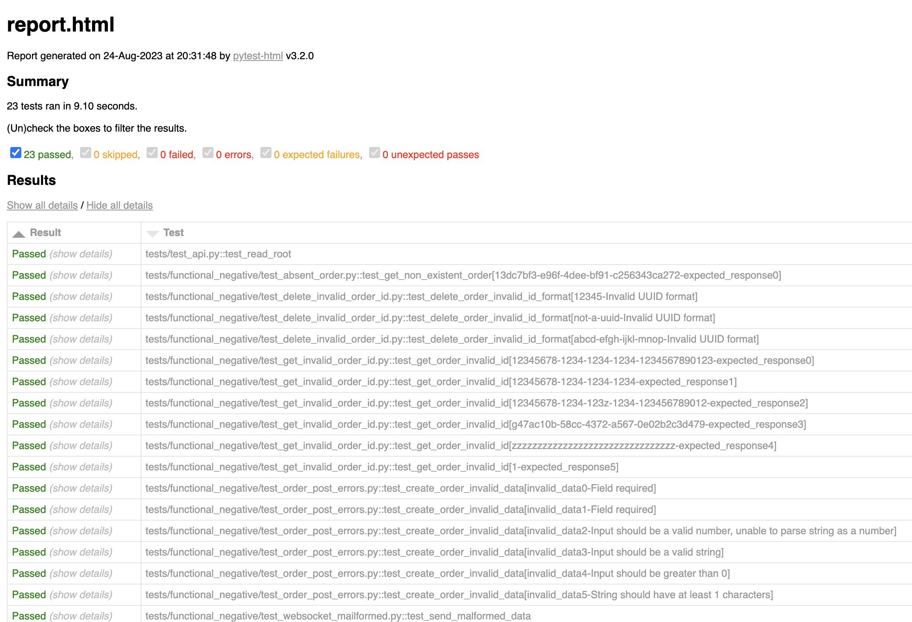

# Forex Websocket API

The project offers a **Websocket API** for forex trading data using **FastAPI**. With the integration of **async** features, it provides quick real-time updates on forex trades. **Docker** is also utilized to ensure consistent deployment across different environments.

## Key Technologies Used:

**Python**: The main language for the project, chosen for its simplicity and wide range of powerful libraries for web development.

**FastAPI**: A web framework for building APIs with Python 3.7+ based on standard Python type hints.

**Uvicorn**: An ASGI server that enables our FastAPI application to serve HTTP requests and WebSockets. 

**Docker**: Utilized for containerization, ensuring a consistent environment for both development and deployment.

**Pytest**: For testing of the API's functionalities, both positive and negative scenarios.

## Server Functionality
The forex trading data API has been developed with both core and advanced functionalities in mind to provide a seamless experience for its users:

### Core Functionality
- **API Endpoints**: The server offers the following endpoints to interact with the orders:

 - GET /orders - Fetch all orders.
 - POST /orders - Create a new order.
 - GET /orders/{orderId} - Get the details of a specific order using its ID.
 - DELETE /orders/{orderId} - Remove an order by its ID.
- **Order Confirmation**: Upon sending a POST /orders request, the server returns a confirmation along with the unique orderId. 

- **Responsive Delays**: Each API endpoint response comes with a random short delay, ranging between 0.1 to 1 second, to emulate real-world server response times.

- **In-memory Database**: Instead of relying on external databases, order data is stored directly in memory, making operations swift and efficient.

### Advanced Functionality
- **Asynchronous Operations**: The server operates asynchronously, ensuring non-blocking operations and faster response times.

- **WebSocket Support**: To enhance real-time functionalities, WebSocket has been integrated into the server.

- **Order Notifications**: Once orders are received from the client, not only is the orderId and orderStatus sent back as a response, but all subscribed clients are also notified about the order's execution status through the WebSocket connection.

## Project Structure

### API Server

- **app**: This is the main application directory.
 - **main.py**: This file contains the core FastAPI app setup. It has the welcoming endpoint and the websocket endpoint.
 - **routes**: This directory is dedicated to the API routes of the project.
     - **orders.py**: Houses the main endpoints of the API.
 - **models.py**: This file contains classes defining the data models used within the app.
 - **notifications.py**: Implements the notification mechanisms for the app.

**Dependencies**: All project dependencies are listed in **requirements.txt**.

### Test Suites and Test Cases

The testing suites is designed to ensure the robustness and correctness of the API.

1. **Functional Positive Tests.** These tests are located in **tests/functional_positive/** and ensure that the main functionalities of the application work as expected.
 - Test creating (POST) a new order
 - Test reading (GET) all orders
 - Test reading (GET) a specific order by ID
 - Test deleting (DELETE) an order by ID
 - WebSocket connection and real-time order status events

2. **Functional Negative Tests.** Found in **tests/functional_negative/**. These tests focus on negative scenarios, they include checks for input validation errors and other unwanted scenarios to make sure the app responds appropriately.
 - Test creating (POST) a new order with invalid data
 - Test reading (GET) an order with an invalid ID format
 - Test reading (GET) an order that doesn't exist
 - Test deleting (DELETE) an order with an invalid ID format
 - Test sending malformed data to webSocket
 

## Testing Techniques
- **Boundary Testing**: Boundary testing focused on scrutinizing how the API responds to both the highest and lowest allowable inputs. 

- **Equivalence Class Partitioning**: Ensured the system would consistently behave for all input values within a specific range.

- **Positive/Negative Testing**: Confirmed the application's proper functionality with valid inputs while also verifying its ability to handle invalid scenarios.

- **Request/Response Validation** : The API was tested for its behavior and efficiency across different inputs, ensuring it handles errors well and manages data sizes properly.

## Getting Started
### Running the API Server:
To run the API server, you can use the following commands:

`
docker network create forexnet
`

`
docker build -t forexapi:latest .
`

`
docker run -d --network=forexnet --name forexapi_container -p 8000:8000 forexapi:latest
`

After running, you can access the server at <a>http://localhost:8000</a>

### Running Tests:
Before running tests, ensure the API server is running, then:

`
docker build -t forexapitests:latest -f Dockerfile.tests .
`

`
docker run --name test_container --network=forexnet forexapitests:latest 
`
### API Documentation
For a look at the API's endpoints please refer to the Swagger documentation available at: <a>http://localhost:8000/docs</a>

## Test Execution Results
Test Execution Results are saved as a standalone report in **tests/report.html**. 

To retrieve the test report from the Docker container you can use the command:

`
docker cp test_container:app/tests/report.html ./tests/docker_report.html 
`

